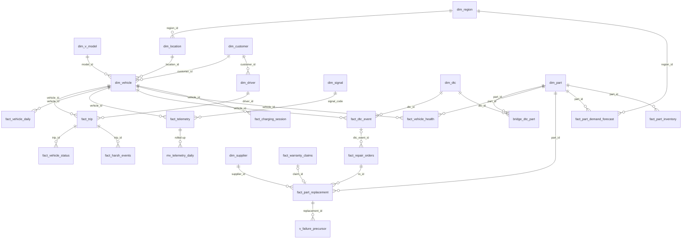

# 04 · Data Model

> Every table the project uses: layer, grain, keys, important columns (with units), OEM source,
> and which modules read it. The DDL is in
> [`scripts/telematics-db/sql/schema.sql`](../scripts/telematics-db/sql/schema.sql); shared tables
> are in [`schema.sql`](../schema.sql).
>
> Last updated: 2026-10-01 (row counts from the 2026-09-30 seed: 200 trucks, 90 days)

## Layers
```
 DIMENSIONS   dim_vehicle* ─ dim_v_model*  dim_location ─ dim_region  dim_customer  dim_application
              dim_part ─ dim_supplier  dim_dealer  dim_date  | dim_driver  dim_signal  dim_dtc  bridge_dtc_part
 RAW          fact_vehicle_status (5-min rFMS snapshots)      fact_telemetry (health-signal readings)
 EVENTS       fact_harsh_events   fact_dtc_event   fact_charging_session
 AGGREGATES   fact_trip (per ignition cycle)   fact_vehicle_daily (per vehicle-day)
 ECOSYSTEM    fact_vehicle_health (predictions)   fact_repair_orders*   fact_part_replacement
              fact_warranty_claims*   fact_part_demand_forecast   fact_part_inventory (read-only)
 ROLLUPS      mv_telemetry_daily (materialized)   v_failure_precursor   v_failure_precursor_summary
 LEGACY       fact_telemetry_legacy   fact_vehicle_health_legacy
 (* = shared table that gained nullable columns; see 05)
```

Design principles:
1. **One grain per table.**
2. **Wide tables where the OEM payload is fixed** (rFMS status); **long tables where it grows**
   (engineering signals, driven by `dim_signal`).
3. **`timestamptz` plus `date_id`** on every fact.
4. **Powertrain-specific columns are nullable:** diesel rows have NULL EV fields and vice versa.
5. **Fleet View reads aggregates;** Asset View reads raw rows.

---

## Telematics dimensions (owned)

### `dim_signal` — signal catalog · 23 rows
**PK:** `signal_code` (e.g. `COOLANT_TEMP`, `DPF_SOOT_LOAD`).

| Column | Notes |
|---|---|
| signal_name, unit, category | category: vehicle, powertrain, fuel, cooling, aftertreatment, electrical, brakes, tyres, ev |
| j1939_pgn, j1939_spn, rfms_field | OEM origin |
| source | `rFMS` / `J1939-remote-diag` / `OEM-backend` / `derived` |
| powertrain | diesel / bev / all |
| sample_interval_s | expected cadence |
| normal_min, normal_max | normal band, used for z-scores ([02 §2](02_Domain_Theory.md#2-anomaly-detection-on-signals)) |
| warn_threshold, crit_threshold, direction | `direction` = which side is bad (`high` / `low`) |

**Health signals sampled into `fact_telemetry`:**

| Powertrain | Signals |
|---|---|
| Diesel (11) | COOLANT_TEMP, OIL_PRESSURE, BATTERY_VOLTAGE, DPF_SOOT_LOAD, DPF_DIFF_PRESSURE, SCR_EFFICIENCY, BOOST_PRESSURE, FUEL_RAIL_PRESSURE, AIR_PRESSURE, BRAKE_LINING_REMAINING, TYRE_PRESSURE |
| BEV (6) | BATTERY_VOLTAGE, AIR_PRESSURE, BRAKE_LINING_REMAINING, TYRE_PRESSURE, HV_SOH, HV_BATTERY_TEMP |

### `dim_dtc` — J1939 fault catalog · 27 rows
**PK:** `dtc_id` = `SPN<spn>-FMI<fmi>`. Unique on (spn, fmi).

**Columns:**
- `spn_description`, `fmi_description`;
- `system`: aftertreatment, cooling, electrical, fuel, air_intake, brakes, transmission,
  powertrain, hv_battery;
- `ecu_source_address`, `ecu_name`;
- `default_lamp`: MIL / AWL / RSL / PL;
- `severity_class`: critical / major / minor;
- `can_derate`, `recommended_action`, `powertrain`.

The catalog has three groups:
- **21 fault-progression codes**, the ones that appear in the fault scenarios.
- **6 intermittent "nuisance" codes:**

  | Code | Meaning |
  |---|---|
  | SPN84-FMI2 | wheel speed |
  | SPN639-FMI2 | CAN bus |
  | SPN96-FMI2 | fuel level |
  | SPN3031-FMI2 | DEF tank temp |
  | SPN523-FMI2 | gear |
  | SPN91-FMI3 | pedal |
- **Proprietary HV-battery codes:** SPN520210 and SPN520211.

### `bridge_dtc_part` · 34 rows
**PK:** (`dtc_id`, `part_id`); `likelihood` ∈ (0,1]. It links a fault code to the `dim_part`
components that typically cause it.

### `dim_driver` · 240 rows
**PK:** `driver_id` (pseudonymised, `DRV00001`…).

**Columns:**
- `driver_alias` ("Driver 0001 · Kochi");
- `driver_card_hash`;
- `license_class` (HGMV / HTV);
- `customer_id`, `home_location_id`;
- `hire_date`, `experience_years`.

There is one primary driver per truck, plus a ~20 % pool of relief drivers per region. Real names
are never stored.

---

## Raw facts (owned)

### `fact_vehicle_status` — rFMS-style snapshot · 133k rows
**Grain:** one row per truck per report: every 5 min while the engine is on, plus IGNITION_ON /
IGNITION_OFF triggers. **Only the last 7 days of the window.**
**PK:** `status_id` (identity).
**FKs:** vehicle, driver, trip, date.

| Group | Columns (units) |
|---|---|
| Time | ts, date_id, trigger_type |
| Position | lat, lon, heading_deg, gnss_speed_kmh |
| Motion | wheel_speed_kmh, tacho_speed_kmh, odometer_km, engine_hours |
| Engine | engine_state (idle / running / pto / ready = BEV), engine_rpm, engine_load_pct, accel_pedal_pct, brake_pedal_active, cruise_active, retarder_active, current_gear |
| Fuel / DEF | fuel_level_pct, total_fuel_used_l, fuel_rate_lph, adblue_level_pct |
| Thermal / electrical | coolant_temp_c, oil_pressure_kpa, battery_voltage_v (24 V), ambient_temp_c |
| Load / driver | gross_combination_weight_kg, driver_working_state (DRIVE / WORK / DRIVER_AVAILABLE) |
| BEV | soc_pct, soh_pct, hv_battery_temp_c, energy_used_kwh_total, regen_kwh_total, charging_state |

**Read by:** Telematics Asset View (24-hour speed trace, map, live status).

### `fact_telemetry` (redesigned) — health-signal readings · 290k rows
**Grain:** one row per truck × signal × reading time, 2 reading times per driving day.
**PK:** `telemetry_id` (identity).

**Columns:**
- `vehicle_id`, `ts`, `date_id`;
- `signal_code` → `dim_signal`;
- `value`, `z_score`, `mahalanobis_score`, `is_anomalous`.

**Read by:**
- Diagnostics Asset View reads raw rows for one truck.
- Fleet views read the `mv_telemetry_daily` rollup instead (see Rollups below).

---

## Event facts (owned)

### `fact_harsh_events` · 30k rows
**PK:** `event_id`.

**Columns:**
- `vehicle_id`, `driver_id`, `trip_id`, `ts`, `date_id`;
- `event_type` (see [02 §5](02_Domain_Theory.md#5-driver-behaviour));
- `severity` (low / medium / high);
- `lat`, `lon`;
- `speed_before_kmh`, `speed_after_kmh`, `peak_g`, `duration_s`;
- `source` (`derived` / `OEM-ADAS`);
- `score_penalty`.

ADAS events exist only on Actros L and eActros (`dim_v_model.adas_equipped`).

### `fact_dtc_event` — DTC lifecycle · 337 rows
**PK:** `dtc_event_id`.

**Columns:**
- `vehicle_id`, `dtc_id`, `driver_id`, `trip_id`;
- `date_id` (the first-seen date);
- `first_seen_ts`, `last_seen_ts`, `cleared_ts`;
- `status` (active / previously_active / cleared);
- `occurrence_count`, `lamp_status`;
- `odometer_km_at_first`, `engine_hours_at_first`;
- `caused_derate`;
- `freeze_frame` (jsonb snapshot of RPM, load, speed, coolant, voltage, ambient and the drifting
  signal);
- `resolved_by_ro_id`.

A few events have `first_seen_ts` before the window start: faults that were already developing
on day 1.

### `fact_charging_session` (BEV) · 4k rows
**PK:** `session_id`.

**Columns:**
- `vehicle_id`, `driver_id`, `date_id`;
- `start_ts`, `end_ts`;
- `city`, `lat`, `lon`;
- `charger_type` (DEPOT_DC / PUBLIC_DC);
- `energy_kwh`, `max_power_kw`;
- `soc_start_pct`, `soc_end_pct`;
- `cost_inr` (₹9/kWh at the depot, ₹18/kWh public).

---

## Aggregate facts (owned)

### `fact_trip` — one row per ignition cycle · 30k rows
**PK:** `trip_id`.

| Group | Columns |
|---|---|
| Identity | vehicle_id, driver_id, date_id |
| Time | start_ts, end_ts |
| Route | start_city, end_city, start/end lat/lon, start/end_odometer_km, distance_km |
| Time split | drive_s, idle_s, pto_s |
| Fuel / energy | fuel_used_l, idle_fuel_l, pto_fuel_l, adblue_used_l (diesel); energy_used_kwh (net), regen_kwh (BEV) |
| Driving style | avg_speed_kmh, max_speed_kmh, overspeed_s, cruise_distance_pct, coasting_distance_pct, rpm_green_band_pct (diesel), brake_applications |
| Load and environment | avg_gcw_kg, ambient_temp_c, co2_kg |
| Scores | harsh_event_count, eco_score |
| Histograms (rFMS accumulated-data style) | `speed_class_s` jsonb {"0-30","30-50","50-70","70-80",">80"} seconds; `rpm_class_s` jsonb {"<700","700-1100","1100-1500","1500-1900",">1900"} seconds |

### `fact_vehicle_daily` — one row per truck per day · 18,000 rows
**PK:** (`vehicle_id`, `date_id`). Every truck has a row for every day of the window, including
idle and workshop days.

| Group | Columns |
|---|---|
| Activity | driver_id, is_operating, in_workshop, trips |
| Distance and time | distance_km, engine_hours, drive_hours, idle_hours, pto_hours |
| Fuel, energy, emissions | fuel_l, idle_fuel_l, adblue_l, energy_kwh, co2_kg |
| Scores | utilization_pct (engine-on h / 24), harsh_event_count, safety_score, eco_score (NULL on non-operating days) |
| Faults | active_dtc_count, amber_lamp_flag, red_lamp_flag, derate_active |
| Odometer | odometer_km_end |
| Data quality | packets_expected, packets_received, last_ping_ts |

**Read by:** all Fleet View KPIs (utilization, idle, uptime, safety, data quality).

---

## Ecosystem facts

### `fact_vehicle_health` (redesigned) — predictions · 20k rows
**Grain:**
- one row per truck × monitored part × week (Sunday 23:30 IST, `trigger = 'weekly'`);
- plus `trigger = 'alert'` rows on the day the model detects a developing fault.

**PK:** `health_id`.

**Columns:**
- `vehicle_id`, `part_id`, `ts`, `date_id`;
- `failure_probability` (30-day);
- `rul_km`, `rul_days`;
- `risk_band` (Critical / High / Medium / Low);
- `active_dtcs` jsonb `[{dtc_id, spn, fmi, lamp, severity}]`;
- `ai_prescriptive_action`;
- `driver_dtc_event_id` (the most severe related DTC);
- `top_signal_code`;
- `trigger`, `model_version`.

**Monitored parts:**

| Powertrain | Parts |
|---|---|
| Diesel | PART009 DEF injector, PART050 radiator, PART010 DPF, PART037 alternator, PART006 injector, PART005 turbo, PART030 brake lining, PART031 air compressor |
| BEV | PART037, PART030, PART031, PART044 HV battery |

### `fact_part_replacement` · 1,252 rows
**Grain:** one row per part swapped in a repair order, covering the whole service life (from
2021).
**PK:** `replacement_id`.

**Columns:**
- `ro_id`, `vehicle_id`, `part_id`, `supplier_id`, `dealer_id`;
- `date_id` (no `dim_date` FK, because history predates 2025);
- `quantity`;
- `odometer_km_at_failure`, `engine_hours_at_failure`, `vehicle_age_days`;
- `failure_mode`;
- `visit_type` (predicted / breakdown / repair);
- `was_predicted`, `dtc_event_id`;
- `in_warranty`, `claim_id`;
- `part_cost_inr`, `labor_hours`.

**Read by:**
- Reliability: life table, Kaplan–Meier / Weibull, supplier and cohort analysis, Part View;
- Diagnostics Asset View: service history;
- Financial.

### `fact_part_demand_forecast` · 6,500 rows
**Grain:** part × region × ISO week: the 13 weeks of the window plus 12 future weeks.
**PK:** `forecast_id`.

**Columns:**
- `week_start`, `is_future`;
- `connected_vehicles`, `fleet_vehicles`;
- `connected_predicted_failures`;
- `connected_actual_replacements` (past weeks only);
- `fleet_expected_demand`;
- `avg_failure_probability`;
- `generated_at`.

**Read by:** Supply Chain, compared with `fact_part_inventory`.

---

## Shared tables (owned by the wider ecosystem)
Only **new nullable columns** were added (in bold); all other columns are untouched.

| Table | Grain / PK | Key columns | New columns |
|---|---|---|---|
| `dim_vehicle` (10,000) | vehicle_id | vin, model_id, customer_id, location_id, application_id, current_status, production_date, in_service_date | **is_connected, telematics_unit_id, telematics_source, connected_since, model_year, warranty_end_date, warranty_km_limit, home_lat, home_lon, primary_driver_id** |
| `dim_v_model` (5) | model_id | model_name, variant, vehicle_type, segment, tonnage_t | **powertrain, engine_family, transmission, axle_config, fuel_tank_l, battery_kwh, gcw_max_kg, base_consumption, consumption_unit, adas_equipped** |
| `fact_repair_orders` (5,244; 2,244 tagged) | ro_id | vehicle_id, dealer_id, date_id (text), billed_hours, labor_cost, nlp_3c_text | **visit_type, dtc_event_id, open_ts, close_ts, downtime_hours, odometer_km, parts_cost, data_source** |
| `fact_warranty_claims` (3,491; 491 tagged) | claim_id | vehicle_id, part_id, dealer_id, supplier_id, date_id (text), claim_amount, nff_flag, ai_risk_score, status, submission_date, adjudication_date, liability_type, recovered_amount, mileage_at_failure (**miles**), cluster_id | **dtc_event_id, ro_id, was_predicted, data_source** |
| `dim_part` (50) | part_id | part_name, part_type, vehicle_subsystem, standard_labor_hours, b10_design_life_miles, unit_cost (INR), supplier_id | — |
| `dim_supplier` (20) | supplier_id | supplier_name, risk_tier (High / Medium / Low) | — |
| `dim_dealer` (100) | dealer_id | region_id, dealer_tier, contracted_labor_rate, bay_count, status | — |
| `dim_location` (100) | location_id | location_name (contains the city), region_id, location_type | — |
| `dim_region` (5) | region_id | region_name, state, country | — |
| `dim_customer` (2,000), `dim_application` (8) | — | customer_type; application_name | — |
| `dim_date` | date_id | year, month_number, month_name, quarter; 2025-01-01 → 2026-12-31 | — |
| `fact_part_inventory` (1,000) | part_inventory_id | part_id, location_id, quantity, inventory_status, forecasted_90d_demand, reorder_recommended | — (read-only) |

Tagged rows (`data_source = 'telematics_sim'`) are simulator output. Untagged rows belong to
other apps.

### View `v_vehicle_context`
One row per vehicle, joining `dim_vehicle` with its model, location, region, customer,
application and primary driver.

**Columns:**
- the vehicle's own columns;
- `model_label` ("BharatBenz 1617R");
- `region_name`, `state`;
- `customer_name`, `application_name`;
- the powertrain fields;
- the telematics fields;
- `primary_driver_alias`.

This is the single source for filter options and filtering.

### Rollups for Diagnostics / Reliability (owned, added 2026-10-01)
Defined in `scripts/telematics-db/sql/schema.sql` §8. All are read-only for anon.

| Object | Kind | Grain | Columns | Read by |
|---|---|---|---|---|
| `mv_telemetry_daily` | materialized view of `fact_telemetry` (145k rows) | vehicle × signal × day | readings, avg / min / max value, mean_abs_z, max_abs_z, max_mahalanobis, anomalous_readings | Diagnostics Signal Health (fleet) |
| `v_failure_precursor` | view: `fact_part_replacement` ⋈ `mv_telemetry_daily` for the 1–30 days before each replacement | replacement × signal × day before | replacement_id, vehicle_id, part_id, signal_code, days_before, mean_abs_z, max_abs_z, anomalous_readings | Reliability Part View (precursor signature) |
| `v_failure_precursor_summary` | view grouped from `v_failure_precursor` | replacement × signal | early_mean_abs_z (days 21–30), late_mean_abs_z (days 1–7), max_abs_z, anomalous_days | Reliability Root Cause (precursor ramp) |

- **Indexes on `mv_telemetry_daily`:** a unique index on (vehicle_id, signal_code, date_id) and an
  index on (date_id).
- **Refresh:** `migrate` and `seed` run `REFRESH MATERIALIZED VIEW mv_telemetry_daily`
  automatically. If `fact_telemetry` is changed any other way, run it by hand.
- **Coverage:** only replacements inside the telemetry window (from 2026-07-03) have precursor
  rows. On the current seed that is 204 of 206.

---

## Legacy tables (read-only, kept for reference)
- **`fact_telemetry_legacy`** (100,000 rows): the old mixed-grain telemetry table.

  | Column group | Columns |
  |---|---|
  | Keys | telemetry_id, vehicle_id |
  | Time | date_id, time_id |
  | Summary values | avg_temp, max_rpm |
  | Anomaly scores | z_score, mahalanobis_score, is_anomalous |
  | Reading | signal_type, signal_value |
- **`fact_vehicle_health_legacy`** (5,000 rows):
  - health_id, vehicle_id, part_id, timestamp;
  - failure_probability, remaining_useful_life (miles);
  - active_dtcs (OBD-style strings such as "P0420");
  - ai_prescriptive_action.

No React hook reads them any more (Diagnostics and Reliability were the last, ported on
2026-10-01).

## Entity-relationship diagram

